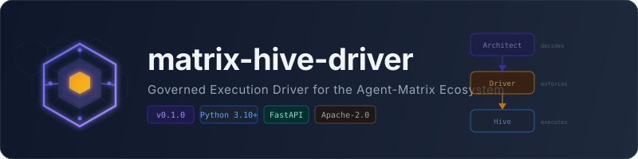
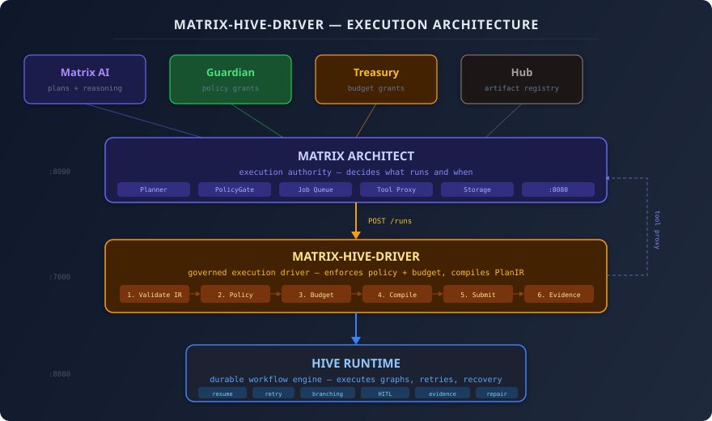

<p align="center">
  
</p>

<p align="center">
  <strong>A governed execution driver that adapts Hive Runtime to Agent-Matrix execution contracts.</strong>
</p>

<p align="center">
  <a href="#why-this-exists">Why</a> &middot;
  <a href="#architecture">Architecture</a> &middot;
  <a href="#quick-start">Quick Start</a> &middot;
  <a href="#api-reference">API</a> &middot;
  <a href="#integrating-with-matrix-architect">Integration</a> &middot;
  <a href="#configuration">Config</a> &middot;
  <a href="#development">Development</a>
</p>

---

## Why This Exists

Matrix Architect is the execution authority in the Agent-Matrix ecosystem &mdash; it decides
**what** runs and **when**. But it does not ship a durable workflow runtime capable of
resume/retry, branching recovery, or step-level evidence capture.

**matrix-hive-driver** bridges that gap. It translates Architect's execution plans into
durable Hive workflows, enforcing **policy** (Guardian) and **budget** (Treasury)
constraints at every step.

### What Hive adds ("muscle")

| Capability | Description |
|:-----------|:------------|
| **Durable workflows** | Resume/retry, long-running jobs that survive restarts |
| **Branching recovery** | If a step fails &rarr; diagnose &rarr; take fix path |
| **Structured evidence** | Logs, traces, outputs captured per step with SHA-256 digests |
| **Reusable templates** | Patch &rarr; test &rarr; deploy patterns as composable graphs |
| **Safe evolution** | Retry/repair only inside policy + budget limits |

### Control role separation

| Role | Owner | Responsibility |
|:-----|:------|:---------------|
| **Decides what runs** | Matrix Architect | Plans, prioritizes, dispatches jobs |
| **Approves what's allowed** | Matrix Guardian | Issues PolicyGrants, gates risky operations |
| **Limits cost/compute** | Matrix Treasury | Issues BudgetGrants, enforces spend caps |
| **Executes workflows** | **This driver + Hive** | Runs what it's given, within granted limits |

### What it does NOT do

- Plan goals (Matrix AI owns that)
- Approve actions (Guardian owns that)
- Allocate budgets (Treasury owns that)
- Bypass controlled tool execution (all tool calls go through a controlled proxy)

---

## Architecture

<p align="center">
  
</p>

### Execution Pipeline

When Architect submits a job, the driver runs this pipeline before anything reaches Hive:

```
PlanIR ──► Validate ──► Enforce Policy ──► Check Budget ──► Compile to Hive-Graph ──► Submit ──► Collect Evidence
```

1. **Validate PlanIR** &mdash; schema, node types, dependency graph
2. **Enforce PolicyGrant** &mdash; check capabilities, block forbidden ops, inject approval gates
3. **Check BudgetGrant** &mdash; initialize metering (MXU, tokens, tool calls)
4. **Compile to Hive-Graph** &mdash; PlanIR nodes map to Hive workflow nodes
5. **Submit to Hive Runtime** &mdash; start durable workflow execution
6. **Collect Evidence** &mdash; SHA-256 digested bundles stored as artifacts

### Trust Boundaries

All effectful tool calls from Hive go through the **Tool Proxy** back to Architect
(or a Guardian-gated gateway). The driver **never** calls external services directly.

---

## Quick Start

### Prerequisites

- [Python 3.10+](https://www.python.org/)
- [uv](https://docs.astral.sh/uv/) (fast Python package manager)

### Install & Run

```bash
git clone https://github.com/agent-matrix/matrix-hive-driver.git
cd matrix-hive-driver

make install    # installs all deps with uv
make test       # runs 31 tests
make dev        # starts FastAPI at http://localhost:7000
```

### Docker Compose

```bash
docker compose -f docker/docker-compose.yml up --build
```

This starts both the driver (`:7000`) and Hive Runtime (`:8080`).

---

## API Reference

Base URL: `http://localhost:7000`

| Method | Endpoint | Description |
|:-------|:---------|:------------|
| `GET` | `/health` | Health check |
| `POST` | `/runs` | Submit a run (PlanIR + PolicyGrant + BudgetGrant) |
| `GET` | `/runs/{run_id}` | Get run status |
| `GET` | `/runs/{run_id}/events` | Get execution events |
| `GET` | `/runs/{run_id}/artifacts` | Get evidence bundles + artifacts |
| `POST` | `/runs/{run_id}/cancel` | Cancel a running workflow |
| `POST` | `/runs/{run_id}/rollback` | Rollback (stubbed for MVP) |

### Example: Submit a Run

```bash
curl -X POST http://localhost:7000/runs \
  -H "Content-Type: application/json" \
  -d '{
    "plan_ir": {
      "plan_id": "job-001",
      "goal": "Patch auth bug and run tests",
      "nodes": [
        {"id": "patch", "type": "PATCH", "inputs": {"diff": "..."}, "required_capabilities": ["fs.apply_patch"], "depends_on": []},
        {"id": "test",  "type": "TEST",  "inputs": {"commands": ["pytest"]}, "required_capabilities": ["verify.run"], "depends_on": ["patch"]}
      ]
    },
    "policy_grant": {
      "grant_id": "pg-001",
      "allowed_capabilities": ["fs.apply_patch", "verify.run"],
      "forbidden_capabilities": []
    },
    "budget_grant": {
      "grant_id": "bg-001",
      "max_mxu": 100.0,
      "hard_stop": true
    },
    "trace": {"matrix_run_id": "job-001"}
  }'
```

---

## Integrating with Matrix Architect

Full integration guide: **[docs/integration-with-architect.md](docs/integration-with-architect.md)**

### Summary of steps

**1. Add the driver to Architect's Docker Compose:**

```yaml
matrix-hive-driver:
  image: ghcr.io/agent-matrix/matrix-hive-driver:latest
  ports: ["7000:7000"]
  environment:
    - HIVE_ENDPOINT=http://hive-runtime:8080
    - TOOL_PROXY_ENDPOINT=http://api:8080/tool-proxy
```

**2. Create a client adapter in Architect** (`integrations/hive_driver_client.py`) that
calls `POST /runs`, `GET /runs/{id}`, etc.

**3. Convert Architect's Plan to PlanIR** &mdash; a thin converter maps `Plan.steps[].ops` to
PlanIR `nodes[]` with proper types (`PATCH`, `TEST`, `DEPLOY`).

**4. Wire into the Celery task pipeline** &mdash; branch in `execute_job_task` based on
`execution_driver == "hive"`.

**5. Expose a Tool Proxy endpoint** on Architect (`/tool-proxy`) so the driver can
route effectful tool calls through a controlled gateway.

**6. Set `HIVE_DRIVER_URL`** in Architect's environment.

### Key data flow

```
Architect Plan                    PlanIR                         Hive-Graph
┌──────────────┐    converter    ┌──────────────┐    compiler   ┌──────────────┐
│ goal         │ ──────────────► │ plan_id      │ ────────────► │ plan_id      │
│ steps[]      │                 │ nodes[]      │               │ nodes[]      │
│  ├─ ops[]    │                 │  ├─ PATCH    │               │  ├─ tool_proxy│
│  └─ verify[] │                 │  └─ TEST     │               │  └─ tool_proxy│
└──────────────┘                 └──────────────┘               └──────────────┘
```

---

## Configuration

Environment variables (see [`.env.example`](.env.example)):

| Variable | Default | Description |
|:---------|:--------|:------------|
| `DRIVER_HOST` | `0.0.0.0` | Bind address |
| `DRIVER_PORT` | `7000` | Service port |
| `HIVE_ENDPOINT` | `http://hive-runtime:8080` | Hive Runtime URL |
| `TOOL_PROXY_ENDPOINT` | `http://matrix-architect:9000/tool-proxy` | Controlled tool proxy |
| `EVIDENCE_SINK` | `local` | Evidence backend (`local` \| `hub` \| `s3` \| `minio`) |
| `LOG_LEVEL` | `info` | Log verbosity |
| `LLM_PROVIDER` | `none` | Optional LLM for dev/CI (`none` \| `ollama`) |
| `OLLAMA_BASE_URL` | `http://localhost:11434` | Ollama URL (when `LLM_PROVIDER=ollama`) |
| `OLLAMA_MODEL` | `llama3.1:8b` | Ollama model (when `LLM_PROVIDER=ollama`) |

---

## Repository Structure

```
src/matrix_hive_driver/
├── api/                        # FastAPI service
│   ├── app.py                  #   Application + route handlers
│   └── schemas.py              #   Pydantic request/response models
├── driver/                     # Core driver contract
│   ├── interfaces.py           #   ExecutionDriver protocol + dataclasses
│   ├── hive_driver.py          #   HiveDriver implementation
│   ├── config.py               #   Settings (pydantic-settings)
│   └── errors.py               #   Exception hierarchy
├── mapping/                    # PlanIR → Hive graph compilation
│   ├── validators.py           #   PlanIR schema validation
│   ├── plan_ir_to_hive.py      #   Compiler: PlanIR → Hive-Graph
│   └── node_templates.py       #   Node type templates
├── enforcement/                # Policy + budget enforcement
│   ├── policy_enforcer.py      #   PolicyGrant checks + approval gate injection
│   ├── budget_meter.py         #   BudgetGrant tracking (MXU/tokens/calls)
│   ├── tool_proxy_client.py    #   Controlled tool execution client
│   └── sandbox.py              #   Workspace normalization
├── runtime/                    # External runtime clients
│   ├── hive_client.py          #   HTTP client to Hive Runtime
│   └── llm_provider.py         #   Optional Ollama fallback for dev/CI
├── evidence/                   # Evidence collection
│   ├── collector.py            #   Evidence bundle builder (SHA-256)
│   ├── artifacts.py            #   Artifact references
│   └── provenance.py           #   Provenance metadata
├── storage/                    # Persistence
│   ├── run_store.py            #   In-memory run store (MVP)
│   └── local_store.py          #   Local filesystem artifact storage
└── observability/              # Logging, tracing, metrics
    ├── logging.py              #   Structured JSON logging (structlog)
    ├── tracing.py              #   OpenTelemetry tracing stub
    └── metrics.py              #   Prometheus metrics stub
```

---

## Development

```bash
make install       # Install all deps with uv
make dev           # Start dev server with hot-reload
make test          # Run 31 unit tests
make test-cov      # Run tests with coverage report
make lint          # Ruff check + format check
make format        # Auto-fix lint issues
make docker-up     # Full Docker Compose stack
make docker-down   # Tear down stack
```

### Running Tests

```bash
$ make test
uv run pytest -q
...............................
31 passed in 0.65s
```

---

## Risks Addressed

| Risk | Mitigation |
|:-----|:-----------|
| Hive bypasses Guardian | All tool calls routed through controlled Tool Proxy |
| Duplicate orchestration | Architect owns contracts; Hive owns mechanics |
| Dependency bloat | Hive isolated in separate repo/service |
| Plan/graph mismatch | PlanIR intermediate representation compiles cleanly to Hive graphs |
| Budget overrun | BudgetMeter tracks MXU, tokens, and tool calls with hard-stop support |
| Unaudited execution | Evidence bundles with SHA-256 digests for every run |

---

## Documentation

| Document | Description |
|:---------|:------------|
| [Architecture](docs/architecture.md) | Technical deep-dive into trust boundaries and execution flow |
| [PlanIR Specification](docs/planir.md) | Schema for the intermediate representation |
| [Integration Guide](docs/integration-with-architect.md) | Step-by-step guide for wiring into Matrix Architect |

---

## License

[Apache-2.0](LICENSE)
